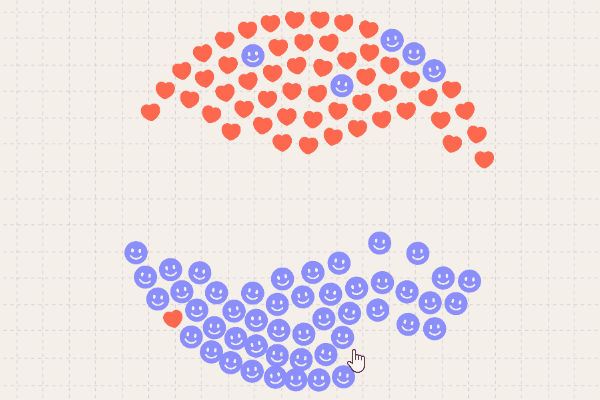

# 重力粒子模拟效果
## 预览效果


## 需要开启服务器端口进行访问
- 可以选择在本地启动一个服务器
- 使用 VSCode 集成的 Live Server 插件

### 元素自定义

```javascript
//./systems/preloadWorldSystem.js
export class PreloadImageSystem {
	update() {
		entityManager.forEach(['imagePath'], (e) => {
			e.image = loadImage(e.imagePath);
		});
	}
}
```
显示的爱心和笑脸粒子元素，在上面的文件代码中修改即可，其他参数自行理解。

